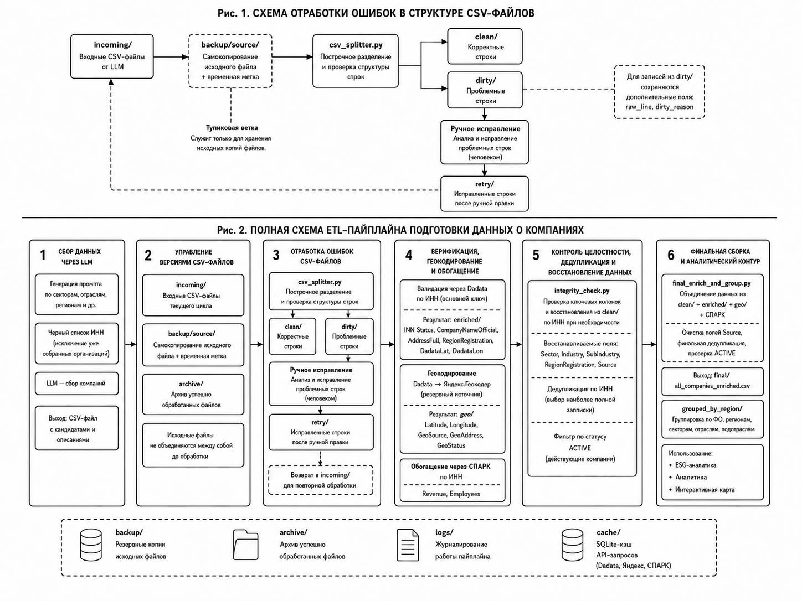

# AI-Assisted ESG Data Pipeline

This repository documents the evolution of a research data pipeline used to collect, validate, enrich, classify, and prepare company-level data for an ESG map.

The repository is organized as two curated code snapshots:

1. `v0_linear_pipeline` — an improved linear pipeline that corresponds to the earlier architecture discussed in the paper.
2. `v1_pre_rfsd_paper_snapshot` — the mature multi-stage, branched pipeline used as the principal paper snapshot.

RFSD/RBBO is not part of the paper snapshot. It is mentioned only as a subsequent extension developed after the architecture described in the article.



## Why two snapshots?

The purpose is not to publish every historical working folder. Instead, the repository shows a compact and understandable transition:

```text
improved linear flow
        ↓
multi-stage pipeline with validation and review branches
```

The first snapshot demonstrates the earlier sequential logic. The second snapshot shows the mature pre-RFSD architecture with row identity, no-data-loss controls, offline SPARK verification, `included/review/excluded` routing, description generation, public exports, and a quality gate.

## Repository structure

```text
ai-esg-data-pipeline/
├── README.md
├── requirements.txt
├── .gitignore
├── docs/
├── figures/
├── snapshots/
│   ├── v0_linear_pipeline/
│   └── v1_pre_rfsd_paper_snapshot/
└── tools/
```

Each snapshot contains:

- a curated `src/` directory;
- a public configuration template;
- dependency information;
- a source manifest;
- folders reserved for synthetic sample data and schemas.

## Paper snapshot

The principal paper snapshot is:

```text
snapshots/v1_pre_rfsd_paper_snapshot
```

The verified working-run totals associated with the archived pre-RFSD version were:

- active records: 2,361;
- included records: 1,890;
- excluded records: 0;
- review records: 471;
- described records: 1,890;
- quality gate: PASS;
- public exports: PASS.

These totals document the archived research run. The full working data and proprietary source exports are not published in this repository.

## What is included

- curated Python source code;
- public configuration templates;
- architecture and methodological documentation;
- prompt documentation;
- validation and routing rules;
- schemas;
- small synthetic examples;
- a repository safety scanner.

## What is intentionally excluded

- API credentials and local secret files;
- raw or unpacked SPARK exports;
- commercial XML, HTML, Excel, and archive files;
- complete working datasets;
- SQLite caches;
- virtual environments;
- logs, backups, archives, and temporary processing folders;
- RFSD/RBBO code and data.

## Reproducibility scope

The repository supports code inspection, architectural reproduction, schema-level reproduction, and testing on synthetic examples. Exact reconstruction of the historical full dataset requires access to the original public-source collection process, external services, and licensed SPARK materials that cannot be redistributed.

See:

- [Architecture evolution](docs/ARCHITECTURE_EVOLUTION.md)
- [Methodology](docs/METHODOLOGY.md)
- [Data schema](docs/DATA_SCHEMA.md)
- [Validation rules](docs/VALIDATION_RULES.md)
- [Routing rules](docs/INCLUDED_REVIEW_EXCLUDED.md)
- [Prompt documentation](docs/PROMPTS.md)
- [Reproducibility](docs/REPRODUCIBILITY.md)
- [Limitations](docs/LIMITATIONS.md)

## Release plan

Planned paper release:

```text
v1.0-paper-snapshot-pre-rfsd
```

The repository is currently being assembled and safety-checked locally. It should not be treated as a published release until the final license, citation metadata, sample data, and release checks are completed.
